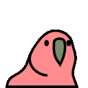
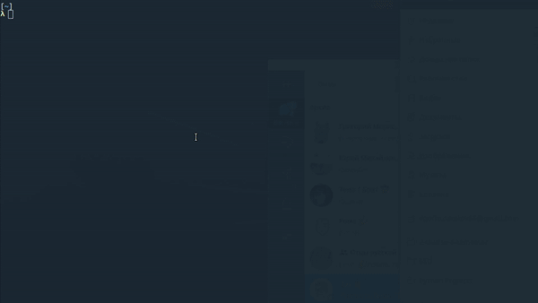

<p align="center">
  
</p>

# :parrot: «Your own Party Parrot for terminal»

## Why do you need to install this?
### — Next question

## Installing
### Make
```
$ git clone https://github.com/endygamedev/party-parrot.git
$ cd party-parrot
$ make install
```

## Usage
```
$ parrot
```

<p align="center">
  
</p>
<p align="center">
  <span> <i> enjoy 😃 </i> </span>
</p>

If you need to stop this just type: `q + <Enter>` or `Ctrl + C`

## Is this fork?
#### — Yes, I took the idea [here](https://github.com/jmhobbs/terminal-parrot) and implemented it on C.

<br>
<p align="center">
  <sub> < <a href="https://endygamedev.github.io"> :man_technologist: endygamedev </a> | <a href="https://endygamedev.github.io/party-parrot/"> :parrot: project webpage</a> /> </sub>
</p>
